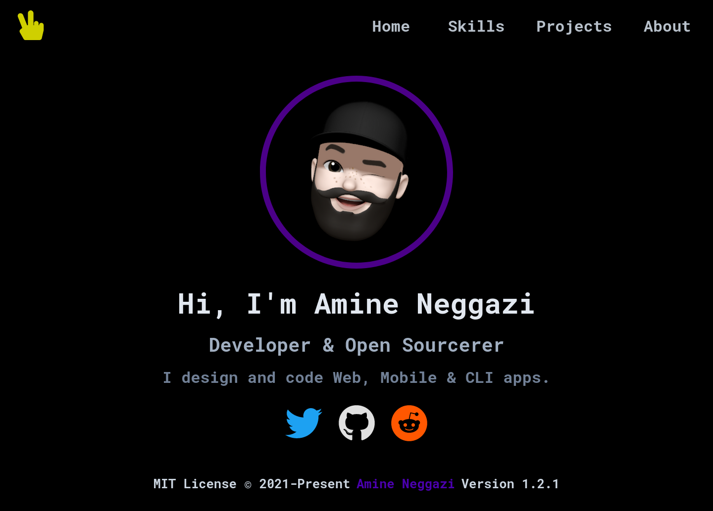

<div align="center">

# `bp`

<h3>
  Personal boilerplate
</h3>

<!-- Badges -->


<!-- Demo image -->



</div>

<!-- TABLE OF CONTENTS -->

## Table of Contents

- [Project Structure 📁](#project-structure)
- [Install 🔨](#install)
- [Use 🚀](#use)
- [Develop ⚙️](#develop)
- [License 📑](#license)

## Project Structure 📁

```
bp/
├── file
├── file
├── folder/
│   ├── folder/
│   │   ├── file
│   │   └── file
│   └── file
└── file
```

## Install 🔨

- Step 1

```shell
$ Command
```

## Use 🚀

> Hint

- Step 1

```shell
$ Command
```

## Develop ⚙️

- Step 1

```shell
$ Command
```

## License 📑

- Please read [bp/LICENSE](https://github.com/nemo256/bp/blob/master/LICENSE)
