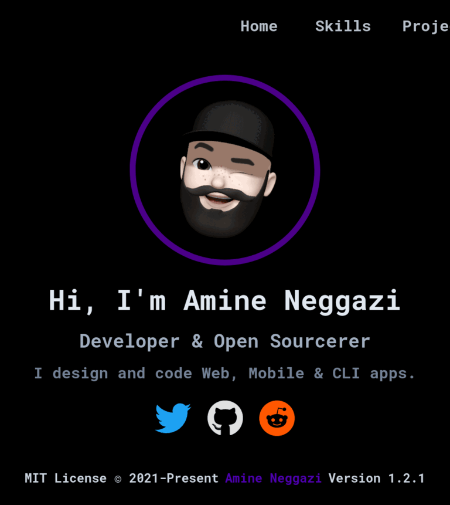

# Portfolio
A custom (personal) portfolio.



<!-- TABLE OF CONTENTS -->
## Table of Contents

* [Setup](#setup)
* [License](#license)
* [Credits](#credits)

## Setup

### Download the project:
```
$ git clone https://github.com/nemo256/portfolio
$ cd portfolio
```

### Install the required dependencies:
```
$ yarn install
```
or
```
$ npm install
```

### Launch a development server:
```
$ yarn dev
```
or
```
$ npm run dev
```

### Check localhost port 3000:
```
$ firefox localhost:3000
```

## License
- Please read portfolio/LICENSE.

## Credits
- Credits go to the developers of [NextJS](https://nextjs.org/).
