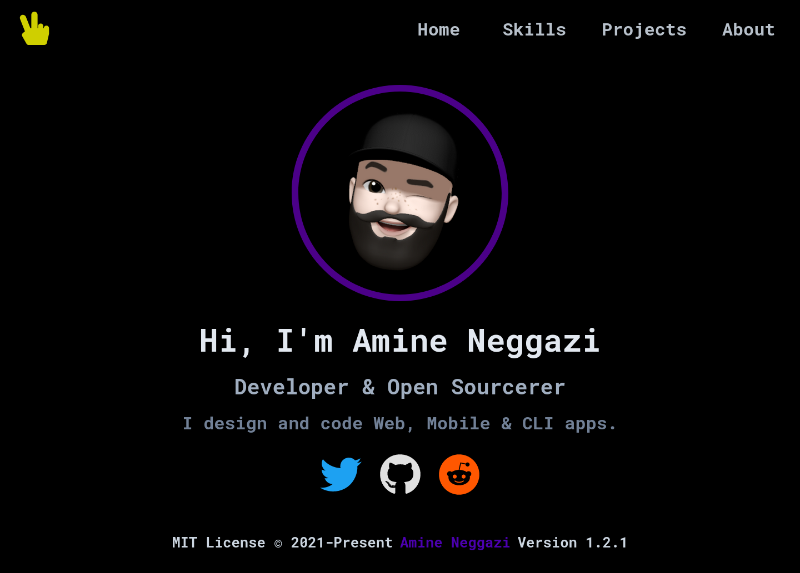

<div align="center">

# `My portfolio`

<h3>
  A custom (personal) portfolio.
</h3>

<!-- Badges -->


<!-- Demo image -->


</div>

# Portfolio
A custom (personal) portfolio.

<!-- TABLE OF CONTENTS -->
## Table of Contents

* [Setup ⚙️](#setup)
* [Credits 🤝](#credits)
* [License 📑](#license)

## Setup ⚙️

### Download the project:
```shell
git clone https://github.com/nemo256/portfolio
cd portfolio
```

### Install the required dependencies:
```shell
yarn install
```
or
```shell
npm install
```

### Launch a development server:
```shell
yarn dev
```
or
```shell
npm run dev
```

### Check localhost port 3000:
```shell
firefox localhost:3000
```

## Credits 🤝
- Credits go to the developers of [NextJS](https://nextjs.org/).

## License 📑
- Please read [portfolio/LICENSE](https://github.com/nemo256/portfolio/blob/master/LICENSE)
